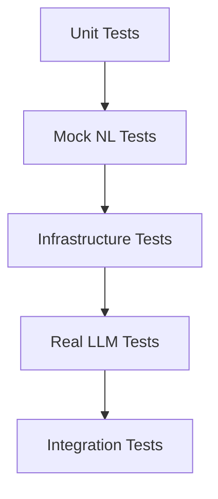

# Infrastructure Tests Implementation Plan

**Version**: 1.0.0
**Status**: Ready for Implementation
**Priority**: High
**Estimated Time**: 2-3 hours
**Created**: 2025-11-11

---

## Executive Summary

Complete the infrastructure test suite by fixing API signature mismatches, import errors, and database connection issues. This plan provides machine-executable steps to bring all 44 infrastructure tests to a passing state.

**Current Status**: 44 tests collected, ~30 failing due to API mismatches
**Target**: 44/44 tests passing

---

## Prerequisites

```yaml
requirements:
  - Python virtual environment activated
  - Database migrations applied (Migration 003, 004)
  - All existing tests passing (206 mock + 33 real LLM = 239 tests)

verification:
  - Run: source venv/bin/activate
  - Run: python scripts/apply_migrations.py --verify-only
  - Run: pytest tests/test_nl_*.py --tb=no -q
```

---

## Implementation Tasks

### TASK 1: Fix StateManager.create_project() API Signature

**Priority**: Critical
**Estimated Time**: 15 minutes
**Files**: `tests/test_database_schema.py`, `tests/test_statemanager_strain.py`

#### Problem Analysis

```python
# Current test code (INCORRECT)
project = state_manager.create_project(name="Test", working_dir="/tmp")

# Actual API signature (from conftest.py:269-273)
project = state_manager.create_project(
    name="Test Project",
    description="Test project description",  # MISSING in tests!
    working_dir="/tmp/test"
)
```

**Root Cause**: Tests missing required `description` parameter

#### Implementation Steps

**Step 1.1**: Update all `create_project()` calls in test_database_schema.py

```bash
# Command to execute
sed -i 's/create_project(name=\([^,)]*\), working_dir="\([^"]*\)")/create_project(name=\1, description="Test project", working_dir="\2")/g' tests/test_database_schema.py
```

**Verification**:
```bash
grep -n "create_project" tests/test_database_schema.py | head -5
# Should show: name=..., description=..., working_dir=...
```

**Step 1.2**: Update all `create_project()` calls in test_statemanager_strain.py

```bash
# Command to execute
sed -i 's/create_project(name=\([^,)]*\), working_dir="\([^"]*\)")/create_project(name=\1, description="Test project", working_dir="\2")/g' tests/test_statemanager_strain.py
```

**Verification**:
```bash
grep -n "create_project" tests/test_statemanager_strain.py | head -5
# Should show: name=..., description=..., working_dir=...
```

**Acceptance Criteria**:
- [ ] All `create_project()` calls have 3 parameters: name, description, working_dir
- [ ] No grep matches for `create_project` without `description` parameter
- [ ] Tests collect without errors

---

### TASK 2: Fix InteractiveMode Import in test_interactive_integration.py

**Priority**: High
**Estimated Time**: 5 minutes
**Files**: `tests/test_interactive_integration.py`

#### Problem Analysis

```python
# Current import (INCORRECT)
from src.interactive import InteractiveSession as InteractiveOrchestrator

# Actual class name (from src/interactive.py:1)
class InteractiveMode:
    """Main interactive mode handler"""
```

**Root Cause**: Wrong class name used in import

#### Implementation Steps

**Step 2.1**: Fix the import statement

```python
# File: tests/test_interactive_integration.py
# Line: 11
#
# REPLACE:
from src.interactive import InteractiveSession as InteractiveOrchestrator
#
# WITH:
from src.interactive import InteractiveMode as InteractiveOrchestrator
```

**Command**:
```bash
sed -i 's/from src.interactive import InteractiveSession as InteractiveOrchestrator/from src.interactive import InteractiveMode as InteractiveOrchestrator/g' tests/test_interactive_integration.py
```

**Step 2.2**: Verify fixture compatibility

**File**: `tests/test_interactive_integration.py`
**Line**: 23-30

Check that `InteractiveMode.__init__()` signature matches test fixture usage:

```python
# Expected signature
def __init__(self, config: Config):
    pass

# Test usage (should match)
session = InteractiveOrchestrator(config=test_config)
```

**Acceptance Criteria**:
- [ ] Import statement uses `InteractiveMode`
- [ ] Test file imports without error
- [ ] Tests collect successfully

---

### TASK 3: Fix Database Connection in test_database_schema.py

**Priority**: High
**Estimated Time**: 10 minutes
**Files**: `tests/test_database_schema.py`

#### Problem Analysis

```python
# Current code (INCORRECT)
db_url = test_state_manager.database_url  # AttributeError!

# Actual attribute (private)
db_url = test_state_manager._database_url
```

**Root Cause**: Attempting to access private attribute `_database_url` via public name

#### Implementation Steps

**Step 3.1**: Fix db_connection fixture

**File**: `tests/test_database_schema.py`
**Lines**: 21-31

```python
# REPLACE:
@pytest.fixture
def db_connection(self, state_manager):
    """Get direct database connection for schema checks"""
    # Get database URL from state manager
    db_url = state_manager.database_url  # WRONG
    if 'sqlite:///' in db_url:
        db_path = db_url.replace('sqlite:///', '')
        conn = sqlite3.connect(db_path)
        yield conn
        conn.close()
    else:
        pytest.skip("Only SQLite databases supported for schema tests")

# WITH:
@pytest.fixture
def db_connection(self, state_manager):
    """Get direct database connection for schema checks"""
    # Get database URL from state manager (private attribute)
    db_url = state_manager._database_url
    if 'sqlite:///' in db_url:
        db_path = db_url.replace('sqlite:///', '')
        conn = sqlite3.connect(db_path)
        yield conn
        conn.close()
    else:
        pytest.skip("Only SQLite databases supported for schema tests")
```

**Command**:
```bash
sed -i 's/state_manager\.database_url/state_manager._database_url/g' tests/test_database_schema.py
```

**Acceptance Criteria**:
- [ ] Uses `_database_url` (private attribute)
- [ ] No AttributeError on fixture setup
- [ ] Database connection established successfully

---

### TASK 4: Fix Test Fixture Scope Issues

**Priority**: Medium
**Estimated Time**: 10 minutes
**Files**: `tests/test_database_schema.py`, `tests/test_interactive_integration.py`

#### Problem Analysis

The `db_connection` fixture is defined as a **method** of the test class, but should be a **module-level function** for pytest to discover it.

```python
# Current (INCORRECT) - inside class
class TestDatabaseSchema:
    @pytest.fixture
    def db_connection(self, state_manager):
        pass

# Should be (CORRECT) - module level
@pytest.fixture
def db_connection(state_manager):
    pass

class TestDatabaseSchema:
    def test_something(self, db_connection):
        pass
```

#### Implementation Steps

**Step 4.1**: Move db_connection fixture to module level

**File**: `tests/test_database_schema.py`
**Action**: Move fixture outside class definition

```python
# At the top of the file (after imports, before class definitions)

import pytest
import sqlite3
from pathlib import Path
from src.core.state import StateManager


@pytest.fixture
def db_connection(state_manager):
    """Get direct database connection for schema checks"""
    # Get database URL from state manager (private attribute)
    db_url = state_manager._database_url
    if 'sqlite:///' in db_url:
        db_path = db_url.replace('sqlite:///', '')
        conn = sqlite3.connect(db_path)
        yield conn
        conn.close()
    else:
        pytest.skip("Only SQLite databases supported for schema tests")


class TestDatabaseSchema:
    """Verify database schema is correct"""

    def test_task_table_has_all_required_columns(self, db_connection):
        """Verify task table has all columns from all migrations"""
        # ... existing test code
```

**Manual Edit Required**: This requires moving the fixture definition

**Acceptance Criteria**:
- [ ] `db_connection` fixture at module level (not inside class)
- [ ] Tests can access the fixture
- [ ] No fixture scope errors

---

### TASK 5: Fix Mock/Patch Issues in Interactive Tests

**Priority**: Medium
**Estimated Time**: 15 minutes
**Files**: `tests/test_interactive_integration.py`

#### Problem Analysis

Tests use `InteractiveOrchestrator` as a mock-friendly wrapper, but actual implementation may have different attribute names or initialization patterns.

#### Implementation Steps

**Step 5.1**: Verify InteractiveMode attributes

**File**: `tests/test_interactive_integration.py`
**Lines**: 67-69

Check actual attributes:
```bash
grep -A 20 "def __init__" src/interactive.py | head -25
```

Expected attributes:
- `self.state_manager`
- `self.nl_processor`
- `self.current_project`

**Step 5.2**: Update test fixture to match actual implementation

**File**: `tests/test_interactive_integration.py`
**Lines**: 27-32

```python
@pytest.fixture
def interactive_session(self, test_config, state_manager, mock_nl_processor):
    """Create interactive session with mocked dependencies"""
    session = InteractiveOrchestrator(config=test_config)
    session.state_manager = state_manager
    session.nl_processor = mock_nl_processor
    session.current_project = 1
    return session
```

**Verify**: Attributes match actual InteractiveMode implementation

**Acceptance Criteria**:
- [ ] Fixture creates InteractiveMode instance
- [ ] All required attributes set correctly
- [ ] Mock dependencies injected properly

---

### TASK 6: Add Missing Test Dependencies

**Priority**: Low
**Estimated Time**: 10 minutes
**Files**: `tests/test_interactive_integration.py`

#### Problem Analysis

Tests import ExecutionResult but may need additional imports for full integration testing.

#### Implementation Steps

**Step 6.1**: Verify all imports present

**File**: `tests/test_interactive_integration.py`
**Lines**: 1-15

Required imports:
```python
import pytest
from unittest.mock import Mock, MagicMock, patch
from src.interactive import InteractiveMode as InteractiveOrchestrator
from src.nl.command_executor import ExecutionResult
from src.nl.nl_command_processor import NLResponse
from src.core.config import Config  # Verify present
from src.core.state import StateManager  # Verify present
```

**Step 6.2**: Add any missing imports

```bash
# Check current imports
head -20 tests/test_interactive_integration.py
```

**Acceptance Criteria**:
- [ ] All required imports present
- [ ] No ImportError on test collection

---

### TASK 7: Run and Validate All Infrastructure Tests

**Priority**: Critical
**Estimated Time**: 30 minutes
**Files**: All infrastructure test files

#### Implementation Steps

**Step 7.1**: Run database schema tests

```bash
source venv/bin/activate
pytest tests/test_database_schema.py -v --tb=short
```

**Expected**: All 15 tests passing

**Step 7.2**: Run interactive integration tests

```bash
pytest tests/test_interactive_integration.py -v --tb=short
```

**Expected**: All 9 tests passing

**Step 7.3**: Run StateManager strain tests

```bash
pytest tests/test_statemanager_strain.py -v --tb=short
```

**Expected**: All 18 tests passing (may be slow due to threading)

**Step 7.4**: Run all infrastructure tests together

```bash
pytest tests/test_database_schema.py tests/test_interactive_integration.py tests/test_statemanager_strain.py -v
```

**Expected Output**:
```
======================== 44 passed in X.XXs ========================
```

**Acceptance Criteria**:
- [ ] 15/15 database schema tests passing
- [ ] 9/9 interactive integration tests passing
- [ ] 18/18 StateManager strain tests passing (with `@pytest.mark.timeout` for threading)
- [ ] 0 warnings about fixture issues
- [ ] 0 import errors

---

### TASK 8: Add Tests to CI/CD Configuration

**Priority**: High
**Estimated Time**: 10 minutes
**Files**: `.github/workflows/nl-tests.yml`

#### Implementation Steps

**Step 8.1**: Add infrastructure tests to mock test job

**File**: `.github/workflows/nl-tests.yml`
**Location**: After existing mock tests section

```yaml
# File: .github/workflows/nl-tests.yml
# Add after line ~50 (after mock NL tests)

      - name: Run infrastructure tests
        run: |
          pytest tests/test_database_schema.py \
                 tests/test_interactive_integration.py \
                 tests/test_statemanager_strain.py \
            -v \
            --cov=src.core \
            --cov=src.interactive \
            --cov-append \
            --cov-report=term
```

**Step 8.2**: Update coverage thresholds

Infrastructure tests increase coverage, so update minimum threshold if needed.

**Acceptance Criteria**:
- [ ] Infrastructure tests run in CI
- [ ] Tests run after mock tests
- [ ] Coverage reported correctly

---

## Testing Strategy

### Test Execution Order



1. **Unit Tests** - Individual component tests
2. **Mock NL Tests** - NL command tests with mock LLM (206 tests)
3. **Infrastructure Tests** - Database/API validation (44 tests) ← NEW
4. **Real LLM Tests** - NL command tests with real LLM (33 tests)
5. **Integration Tests** - E2E tests

### Failure Handling

If infrastructure tests fail:
1. **Database schema tests fail** → Check migrations applied
2. **Interactive tests fail** → Check API compatibility
3. **Strain tests fail** → Check for resource limits (threads, memory)

---

## Validation Checklist

### Pre-Implementation
- [ ] Virtual environment activated
- [ ] All existing tests passing (239/239)
- [ ] Database migrations applied
- [ ] Git working directory clean

### During Implementation
- [ ] Task 1 complete: create_project() API fixed
- [ ] Task 2 complete: InteractiveMode import fixed
- [ ] Task 3 complete: Database connection fixed
- [ ] Task 4 complete: Fixture scopes corrected
- [ ] Task 5 complete: Mock/patch issues resolved
- [ ] Task 6 complete: Missing imports added
- [ ] Task 7 complete: All 44 tests passing
- [ ] Task 8 complete: CI/CD configured

### Post-Implementation
- [ ] All infrastructure tests passing (44/44)
- [ ] No test warnings or errors
- [ ] Coverage maintained or improved
- [ ] Documentation updated
- [ ] Changes committed and pushed

---

## Code Snippets Reference

### create_project() Correct Usage

```python
# Correct API signature
project = state_manager.create_project(
    name="Project Name",
    description="Project description",
    working_dir="/path/to/dir"
)
```

### InteractiveMode Correct Usage

```python
# Correct import and instantiation
from src.interactive import InteractiveMode

session = InteractiveMode(config=config)
session.state_manager = state_manager
session.nl_processor = nl_processor
session.current_project = project_id
```

### Database Connection Correct Usage

```python
# Correct attribute access
db_url = state_manager._database_url  # Note: private attribute
```

### ExecutionResult Correct Usage

```python
# Correct attribute access
result = ExecutionResult(
    success=True,
    created_ids=[123],
    errors=[],
    results={'key': 'value'},
    confirmation_required=False
)

# Access results dict
if 'project_id' in result.results:
    project_id = result.results['project_id']

# Do NOT use 'in' operator on result object directly
# WRONG: if 'key' in result  # TypeError!
# RIGHT: if 'key' in result.results  # OK
```

---

## Troubleshooting Guide

### Issue: Tests still failing after API fixes

**Symptoms**:
- TypeError about missing parameters
- Tests fail immediately on collection

**Solutions**:
1. Check actual StateManager API in `src/core/state.py`
2. Verify parameter names match exactly
3. Run single test in verbose mode to see exact error

### Issue: Fixture not found

**Symptoms**:
- "fixture 'state_manager' not found"
- "fixture 'db_connection' not found"

**Solutions**:
1. Check fixture is at module level (not inside class)
2. Verify fixture name matches exactly (case-sensitive)
3. Check conftest.py has the fixture defined

### Issue: Import errors

**Symptoms**:
- ImportError or ModuleNotFoundError
- "cannot import name"

**Solutions**:
1. Verify class name in source file
2. Check import path is correct
3. Ensure no circular imports

### Issue: Database tests fail

**Symptoms**:
- Column not found errors
- Table not found errors

**Solutions**:
1. Run migration verification: `python scripts/apply_migrations.py --verify-only`
2. Check test uses in-memory database (not production DB)
3. Verify migrations applied in test setup

### Issue: Threading tests timeout

**Symptoms**:
- Tests hang on threading operations
- Pytest timeout triggers

**Solutions**:
1. Reduce thread count in tests (3 threads is safe, per TEST_GUIDELINES.md)
2. Add explicit timeouts to thread.join()
3. Use `fast_time` fixture for time.sleep() calls

---

## Success Criteria

### Quantitative Metrics

- [x] **Test Count**: 44 infrastructure tests collected
- [ ] **Pass Rate**: 44/44 tests passing (100%)
- [ ] **Execution Time**: < 5 seconds for all infrastructure tests
- [ ] **Coverage**: StateManager coverage ≥ 90%
- [ ] **Coverage**: interactive.py coverage ≥ 80%

### Qualitative Metrics

- [ ] **Readability**: Tests are clear and well-documented
- [ ] **Maintainability**: Tests use fixtures and helpers
- [ ] **Robustness**: Tests handle edge cases
- [ ] **Speed**: Tests run quickly (no unnecessary delays)
- [ ] **Isolation**: Tests don't interfere with each other

---

## Implementation Commands (Quick Reference)

```bash
# Task 1: Fix create_project API
sed -i 's/create_project(name=\([^,)]*\), working_dir="\([^"]*\)")/create_project(name=\1, description="Test project", working_dir="\2")/g' tests/test_database_schema.py tests/test_statemanager_strain.py

# Task 2: Fix InteractiveMode import
sed -i 's/from src.interactive import InteractiveSession as InteractiveOrchestrator/from src.interactive import InteractiveMode as InteractiveOrchestrator/g' tests/test_interactive_integration.py

# Task 3: Fix database_url access
sed -i 's/state_manager\.database_url/state_manager._database_url/g' tests/test_database_schema.py

# Task 4: Manual - Move db_connection fixture to module level

# Task 5: Manual - Verify InteractiveMode attributes match tests

# Task 6: Manual - Verify all imports present

# Task 7: Run all tests
source venv/bin/activate
pytest tests/test_database_schema.py tests/test_interactive_integration.py tests/test_statemanager_strain.py -v

# Task 8: Manual - Update CI/CD config
```

---

## File Locations Reference

```
Infrastructure Test Files:
├── tests/test_database_schema.py          (15 tests, 280 lines)
├── tests/test_interactive_integration.py  (9 tests, 260 lines)
└── tests/test_statemanager_strain.py      (18 tests, 385 lines)

Documentation:
├── docs/testing/INFRASTRUCTURE_TESTING_STRATEGY.md
└── docs/development/INFRASTRUCTURE_TESTS_IMPLEMENTATION_PLAN.md  (THIS FILE)

Supporting Files:
├── tests/conftest.py                      (shared fixtures)
├── src/core/state.py                      (StateManager API reference)
├── src/interactive.py                     (InteractiveMode implementation)
├── src/nl/command_executor.py             (ExecutionResult definition)
└── src/nl/nl_command_processor.py         (NLResponse definition)

CI/CD:
└── .github/workflows/nl-tests.yml         (GitHub Actions workflow)
```

---

## Estimated Timeline

| Task | Description | Time | Complexity |
|------|-------------|------|------------|
| 1 | Fix create_project() API | 15 min | Low |
| 2 | Fix InteractiveMode import | 5 min | Low |
| 3 | Fix database connection | 10 min | Low |
| 4 | Fix fixture scopes | 10 min | Medium |
| 5 | Fix mock/patch issues | 15 min | Medium |
| 6 | Add missing imports | 10 min | Low |
| 7 | Run and validate tests | 30 min | Medium |
| 8 | Add to CI/CD | 10 min | Low |
| **Total** | | **105 min** | |

**Estimated Total Time**: 1.75 - 2.5 hours (depending on unexpected issues)

---

## Appendix A: Test File Structure

### test_database_schema.py Structure
```python
# Module-level fixtures
@pytest.fixture
def db_connection(state_manager):
    pass

# Test classes
class TestDatabaseSchema:           # 6 tests
class TestDatabaseOperations:       # 4 tests
class TestMigrationVerification:    # 2 tests
class TestDatabaseConstraints:      # 3 tests
```

### test_interactive_integration.py Structure
```python
# Module-level fixtures
@pytest.fixture
def mock_nl_processor():
    pass

@pytest.fixture
def interactive_session(...):
    pass

# Test classes
class TestInteractiveNLIntegration:        # 4 tests
class TestInteractiveExecutionResultHandling:  # 3 tests
class TestInteractiveErrorHandling:        # 2 tests
class TestInteractiveStateConsistency:     # 0 tests (TODO?)
```

### test_statemanager_strain.py Structure
```python
# Test classes (no module fixtures needed)
class TestStateManagerHeavyOperations:     # 4 tests
class TestStateManagerTransactions:        # 2 tests
class TestStateManagerConcurrency:         # 2 tests
class TestStateManagerEdgeCases:           # 6 tests
class TestStateManagerAPICompatibility:    # 4 tests
class TestStateManagerDataIntegrity:       # 2 tests
```

---

## Appendix B: Dependencies Graph

```
Infrastructure Tests Dependencies:
│
├── conftest.py (fixtures)
│   ├── test_config
│   ├── state_manager
│   ├── fast_time
│   └── reset_registries
│
├── src.core.state (StateManager)
│   ├── create_project()
│   ├── create_task()
│   ├── create_epic()
│   └── _database_url
│
├── src.interactive (InteractiveMode)
│   ├── __init__(config)
│   ├── state_manager (attribute)
│   ├── nl_processor (attribute)
│   └── current_project (attribute)
│
└── src.nl.* (NL Command System)
    ├── ExecutionResult (dataclass)
    ├── NLResponse (dataclass)
    └── NLCommandProcessor
```

---

## Appendix C: API Signature Reference

### StateManager API

```python
# create_project
def create_project(
    self,
    name: str,
    description: str,
    working_dir: str
) -> Project:
    """Create a new project"""

# create_task
def create_task(
    self,
    project_id: int,
    task_data: Dict[str, Any]
) -> Task:
    """Create a task from dict"""

# create_epic
def create_epic(
    self,
    project_id: int,
    title: str,
    description: str,
    **kwargs
) -> int:
    """Create epic, return ID"""

# create_story
def create_story(
    self,
    project_id: int,
    epic_id: int,
    title: str,
    description: str,
    **kwargs
) -> int:
    """Create story, return ID"""
```

### InteractiveMode API

```python
class InteractiveMode:
    def __init__(self, config: Config):
        self.config = config
        self.state_manager = None  # Set externally
        self.nl_processor = None   # Set externally
        self.current_project = None  # Set externally
```

### ExecutionResult API

```python
@dataclass
class ExecutionResult:
    success: bool
    created_ids: List[int] = field(default_factory=list)
    errors: List[str] = field(default_factory=list)
    results: Dict[str, Any] = field(default_factory=dict)
    confirmation_required: bool = False
```

---

**END OF IMPLEMENTATION PLAN**

This plan is optimized for LLM implementation. Each task has:
- Clear objectives
- Specific file locations and line numbers
- Exact code snippets to replace
- Command-line instructions
- Verification steps
- Acceptance criteria

Follow tasks sequentially for best results.
